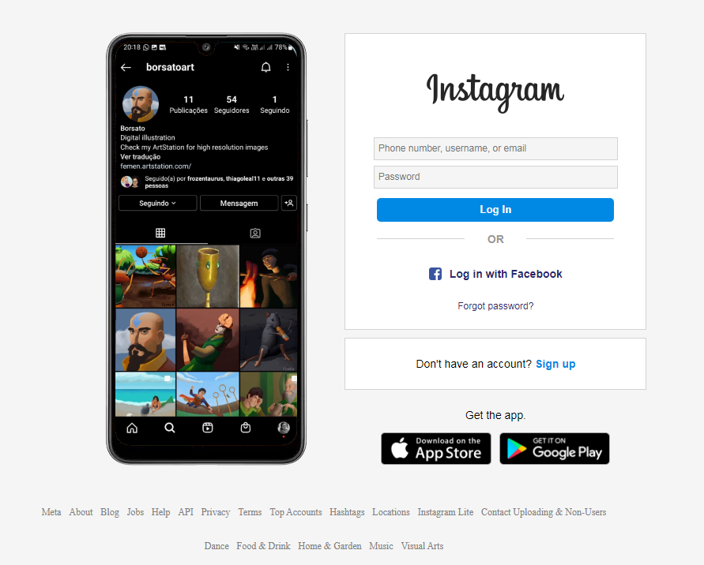
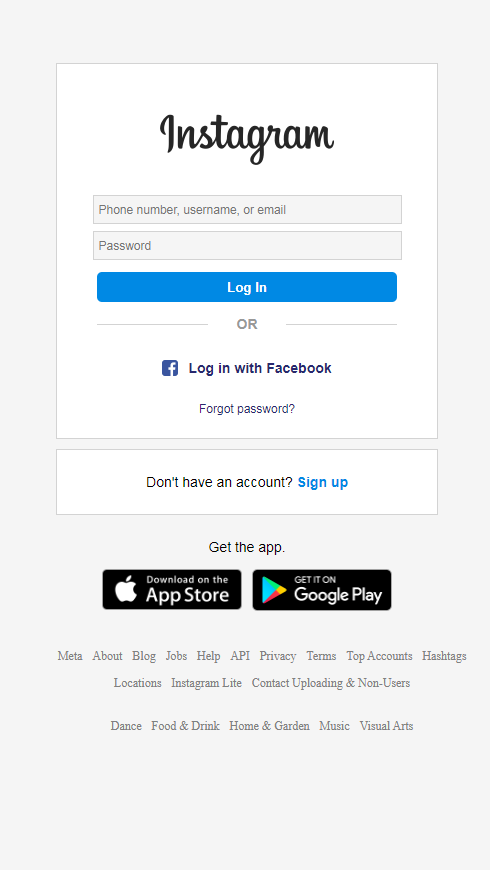

# Instagram login page recreation

Instagram login page recreation made for the Santander Bootcamp Fullstack Developer at Dio._

## Smartphone picture

The smartphone picture is composed of two pictures: a picture of a smartphone with no opacity on the screen region overlaping a screenshot of the Instagram app. The choice to make it this way instead of simply having a single image was made to facilitate the further implementation of the transition between multiple screenshots in the same phone frame, which happens in the original Instagram login page.

## Responsiveness

This recreation is as responsive as the original page. All elements have fixed sizes and the smartphone picture is hidden when the screen width reaches a minimum size (750px).

## /documentation

At /documentation are screenshots of the original Instagram login page as it was at the time of the development of this recreation (06/22/2022). There are also screenshots of the recreation.

## Screenshots

Screenshots of the recreation

